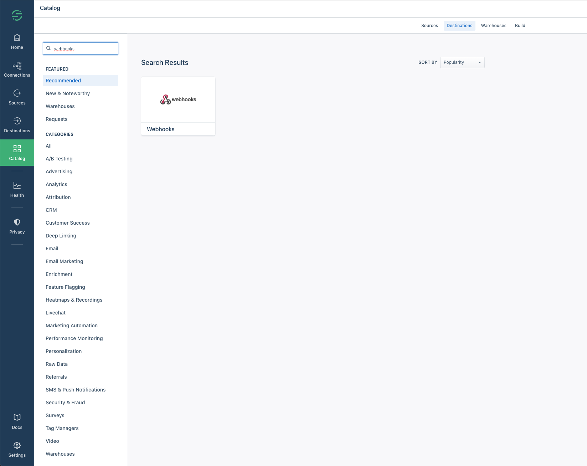
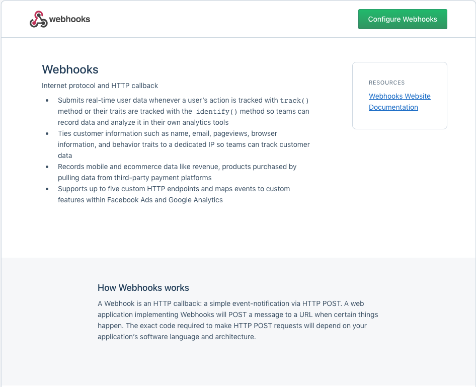
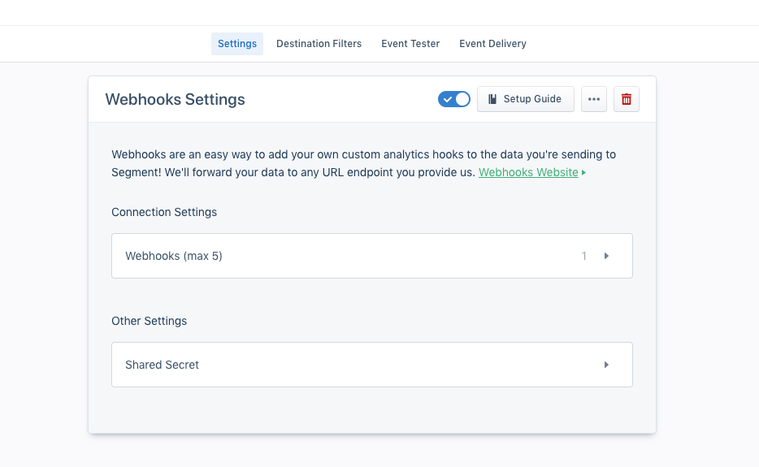
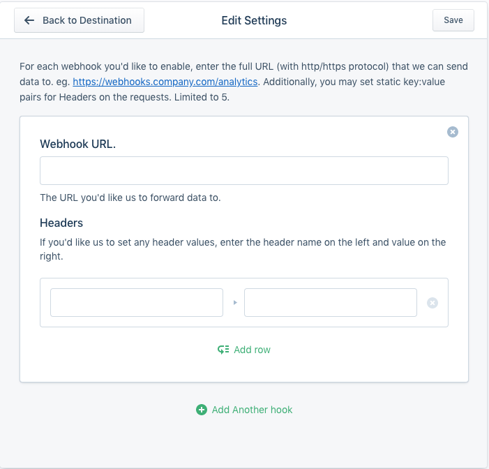

# Segment integration

In order for us to validate your analytics events structure, we need you to integrate the `source` created on validata's app to your segment's `source`. To do that we have the following options:

- Webhooks
- Destinations (Coming soon)

## Webhook

1. When you create a source on segment to receive your analytics events, you can set up multiple destinations, one of those destinations is called `webhooks`:

2. As you can see on the image above, when you are searching for destinations to add to your app, you can search for `webhooks` and select the only option that appears.



3. Once you do that, segment will show you a page explaining how webhooks work and where you can use it. Its highly recommended to read this page before following on.

4. When you finish reading what a webhook is and have decided to continue on, click on `Configure Webhooks`.



5. Then select the `source` you are configuring. (Obs. This source **must** match the source you created for validata)

6. Once you selected your source, you will be prompted with a page to configure your webhook:

7. Click on the `Connection Settings` section.



8. You will be prompted with a screen that asks you to configure the URL and the headers to be sent with the request. Here is where you will configure `Validata's` URL and set the `auth-token` header, where we will identify you and the source.

```
Webhook URL:
- https://validata.app/validate
Headers:
 - "auth-token: your-source-token"
```


9. Once you save it, segment will start sending events to our webhook endpoint, and we will start validating them.

10. Go back to validata's web application and create your events' specification.
